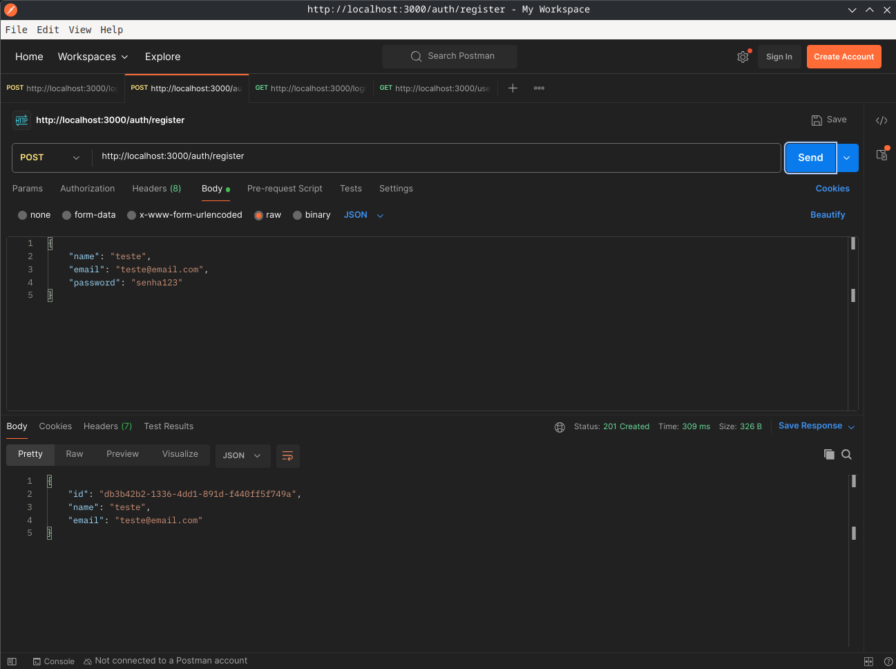
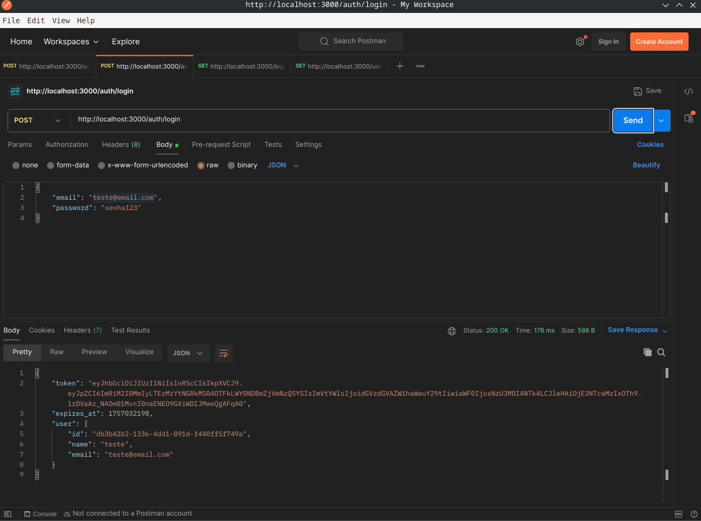
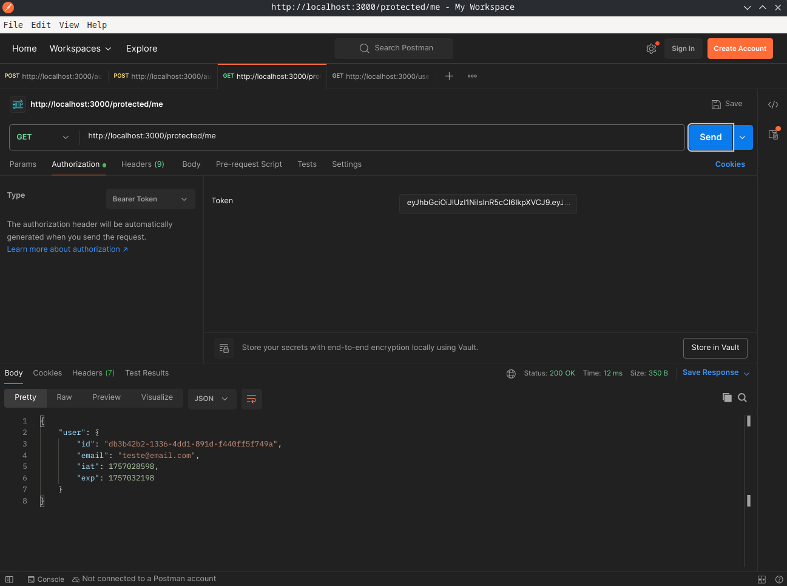
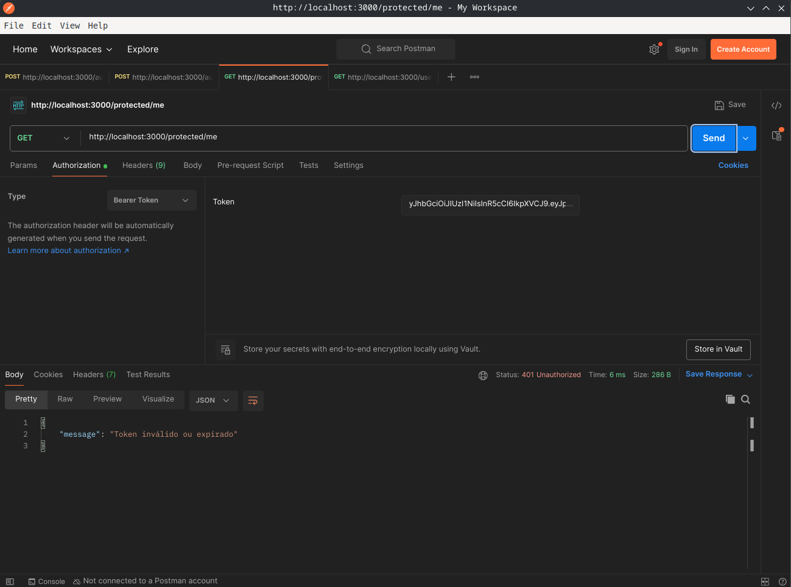

# API de controle de usuários
A API de controle conta com a geração de tokens JWT e hash de senhas que são cadastradas e armazenadas no bando de dados.

## 1: Cadastro:

## 2: Login:

## 3: Teste rota protegida por token:

## 4: Logout:

## 5: Teste rota protegida por token:

